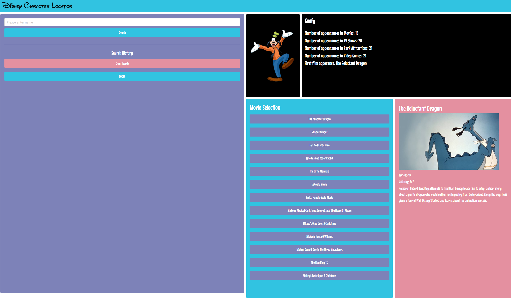

# Disney Character Locator

## Description

Provide a short description explaining the what, why, and how of your project. Use the following questions as a guide:
Our website serves the purpose of being able to search a Disney character and returna list of films that character is in. This is done by taking the user input and cross referencing it between a Disney api and Movie Review api. The data is then display and saved respectively per search. 

## Installation

To use this website, you can  visit it via this url: 
Follow the instructions on the page.

## Usage

Visit the GitHub repo via this url:
Visit the webpage via the url in installion.

.png)

## Credits

GitHub Collaborators:
    Eric Kim, Layne Nigro, Alexander Barlow and Taj Bland.

Api Resources:
    Movie Review API:
    https://developers.themoviedb.org/3/getting-started/introduction
    Disney API:
    https://disneyapi.dev/ 

## Features

Our project utilizes local storage to save inputs and redisplay the information tied to the input via a button. Our project also utilizes two apis which are cross referenced with each other to display a plethora of information to the user per their input. 

## How to Contribute

If you would like to contribute, please visis the GitHub repo via the provided link in Usage section and contact one of the current Contributors. 

